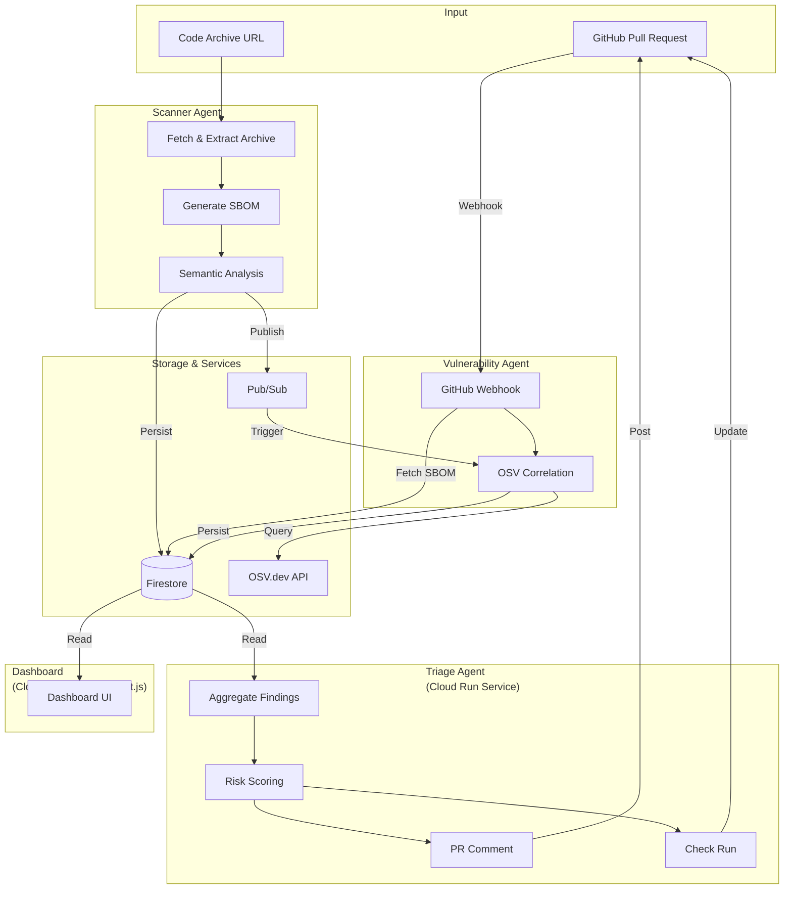

# Aegis Chain

**AI-Powered Multi-Agent Security System for Supply Chain Code Security**

Aegis Chain is a production-ready multi-agent security system deployed on Google Cloud Run that detects semantic security flaws introduced by new code dependencies. It runs GPU-backed Code LLM scans, correlates results with OSV/NVD vulnerability databases, and posts comprehensive triage reports to GitHub.

## Overview

Aegis Chain provides automated security scanning for pull requests and code archives by:

1. **Scanning** code archives for dependencies and semantic security patterns
2. **Correlating** dependencies with known vulnerabilities (OSV/NVD)
3. **Triaging** findings with risk scoring and automated GitHub integration

### Key Features

- **Semantic Security Analysis** - Detects dangerous code patterns (unsafe yaml.load, subprocess shell=True, eval(), etc.)
- **SBOM Generation** - Automatic Software Bill of Materials from package.json and requirements.txt
- **Vulnerability Correlation** - Real-time correlation with OSV.dev API
- **Risk Scoring** - Configurable risk assessment with weighted scoring
- **GitHub Integration** - Automated PR comments and check run status
- **Dashboard** - Web dashboard for viewing scan results and findings

## Architecture

Aegis Chain consists of four main components:



### 1. Scanner Agent (Cloud Run Job - GPU)
- Downloads and extracts code archives
- Generates SBOM from package manifests
- Performs semantic security analysis
- Persists results to Firestore
- Publishes scan summaries to Pub/Sub

### 2. Vulnerability Agent (Cloud Run Service)
- Receives GitHub webhooks for PR events
- Correlates SBOM components with OSV.dev
- Handles rate limiting with exponential backoff
- Persists enriched vulnerability data

### 3. Triage Agent (Cloud Run Service)
- Aggregates scan and correlation data
- Calculates risk scores
- Posts formatted PR comments
- Creates GitHub check runs

### 4. Dashboard (Cloud Run Service - Next.js)
- Reads from Firestore
- Displays recent scans and findings
- Shows PR details with CVEs and SBOM components

### Data Flow

1. **Scan Trigger**: Code archive URL is provided (via PR or manual trigger)
2. **SBOM Generation**: Scanner extracts dependencies from package.json/requirements.txt
3. **Security Analysis**: Semantic patterns are detected (unsafe yaml.load, eval(), etc.)
4. **Persistence**: Results stored in Firestore, summary published to Pub/Sub
5. **Correlation**: Vulnerability agent queries OSV.dev for known CVEs
6. **Triage**: Risk score calculated, PR comment and check run posted
7. **Dashboard**: Users view results via web interface

## Prerequisites

- Google Cloud Platform account with billing enabled
- GCP Project with the following APIs enabled:
  - Cloud Run
  - Cloud Firestore
  - Cloud Pub/Sub
  - Cloud Build (for deployment)
- Python 3.11+
- Node.js 18+ (for dashboard)
- GitHub App (for PR integration - optional)

## Quick Start

### 1. Clone the Repository

```bash
git clone https://github.com/Manan23-dev/AegisChain.git
cd AegisChain
```

### 2. Set Up Environment Variables

Create a `.env` file in the project root:

```bash
# GCP Configuration
GCP_PROJECT_ID=your-project-id
GCP_REGION=europe-west4

# Firestore
FIRESTORE_COLLECTION=aegis_findings

# Pub/Sub
PUBSUB_TOPIC=aegis-scan-requests

# OSV API
OSV_API_URL=https://api.osv.dev/v1/query

# GitHub Integration (Optional)
GITHUB_APP_ID=your-app-id
GITHUB_INSTALLATION_ID=your-installation-id
GITHUB_PRIVATE_KEY_BASE64=base64-encoded-private-key
GITHUB_OWNER=your-org
GITHUB_REPO=your-repo
WEBHOOK_SECRET=your-webhook-secret

# Dashboard
PORT=8080
```

### 3. Install Dependencies

#### Scanner Agent
```bash
cd src/agents/scanner_agent/app
pip install -r requirements.txt
```

#### Vulnerability Agent
```bash
cd src/agents/vulnerability_agent/app
pip install -r requirements.txt
```

#### Triage Agent
```bash
cd src/agents/triage_agent/app
pip install -r requirements.txt
```

#### Dashboard
```bash
cd src/dashboard/app
npm install
```

### 4. Local Development

#### Run Scanner Agent (Local)
```bash
cd src/agents/scanner_agent/app
export SCAN_PAYLOAD='{"archive_url":"https://example.com/archive.zip","pr_number":"123","commit_sha":"abc123"}'
python main.py
```

#### Run Vulnerability Agent (Local)
```bash
cd src/agents/vulnerability_agent/app
uvicorn main:app --host 0.0.0.0 --port 8080
```

#### Run Triage Agent (Local)
```bash
cd src/agents/triage_agent/app
uvicorn main:app --host 0.0.0.0 --port 8080
```

#### Run Dashboard (Local)
```bash
cd src/dashboard/app
npm run dev
```

## Configuration

### Environment Variables

| Variable | Description | Required | Default |
|----------|-------------|----------|---------|
| `GCP_PROJECT_ID` | GCP Project ID | Yes | - |
| `GCP_REGION` | GCP Region | No | `europe-west4` |
| `FIRESTORE_COLLECTION` | Firestore collection name | No | `aegis_findings` |
| `PUBSUB_TOPIC` | Pub/Sub topic name | No | `aegis-scan-requests` |
| `OSV_API_URL` | OSV API endpoint | No | `https://api.osv.dev/v1/query` |
| `GITHUB_APP_ID` | GitHub App ID | No | - |
| `GITHUB_INSTALLATION_ID` | GitHub Installation ID | No | - |
| `GITHUB_PRIVATE_KEY_BASE64` | Base64-encoded private key | No | - |
| `GITHUB_OWNER` | GitHub repository owner | No | - |
| `GITHUB_REPO` | GitHub repository name | No | - |
| `WEBHOOK_SECRET` | GitHub webhook secret | No | - |
| `RISK_HIGH_THRESHOLD` | High risk score threshold | No | `8.0` |
| `RISK_MEDIUM_THRESHOLD` | Medium risk score threshold | No | `4.0` |
| `SAMPLE_MODE` | Enable sample mode for testing | No | `false` |

### Risk Scoring

Risk scores are calculated using weighted factors:

- **CVE Severity Weights:**
  - CRITICAL: 3.0
  - HIGH: 2.0
  - MEDIUM: 1.0
  - LOW: 0.5

- **Dangerous Primitives:** 2.0 per finding
- **Affected Files:** 0.5 per file (capped at 10)

**Risk Levels:**
- **High:** Score ≥ 8.0
- **Medium:** Score 4.0 - 7.9
- **Low:** Score < 4.0

## API Endpoints

### Vulnerability Agent

#### `GET /healthz`
Health check endpoint.

**Response:**
```json
{
  "status": "healthy"
}
```

#### `POST /webhook/github`
GitHub webhook endpoint for PR events.

**Headers:**
- `X-Hub-Signature-256`: HMAC signature
- `X-GitHub-Event`: Event type (must be `pull_request`)

**Response:**
```json
{
  "status": "accepted",
  "pr_number": "123",
  "commit_sha": "abc123"
}
```

#### `POST /correlate`
Manual correlation endpoint.

**Request Body:**
```json
{
  "pr_number": "123",
  "commit_sha": "abc123",
  "components": [
    {
      "name": "requests",
      "version": "2.28.0",
      "ecosystem": "pypi"
    }
  ],
  "persist": true
}
```

### Triage Agent

#### `GET /healthz`
Health check endpoint.

#### `POST /triage`
Triage endpoint for risk scoring and GitHub integration.

**Request Body:**
```json
{
  "pr_number": "123",
  "commit_sha": "abc123",
  "owner": "your-org",
  "repo": "your-repo"
}
```

**Response:**
```json
{
  "pr_number": "123",
  "commit_sha": "abc123",
  "risk_score": 6.5,
  "risk_level": "medium",
  "cve_count": 3,
  "findings_count": 5,
  "github_comment_posted": true,
  "github_check_run_created": true
}
```

### Dashboard API

#### `GET /api/findings`
Returns latest 50 scan records grouped by PR.

**Response:**
```json
{
  "findings": [
    {
      "pr_number": "123",
      "commit_sha": "abc123",
      "scan": { ... },
      "correlation": { ... },
      "triage": { ... }
    }
  ]
}
```

#### `GET /api/pr/[id]`
Returns detailed PR information.

**Response:**
```json
{
  "pr_number": "123",
  "commit_sha": "abc123",
  "scan": { ... },
  "correlation": { ... },
  "triage": { ... },
  "sbom_components": [ ... ],
  "cves": [ ... ]
}
```

## Testing

### Sample Mode

Enable sample mode for testing without actual code analysis:

```bash
export SAMPLE_MODE=true
```

This returns deterministic sample findings for smoke tests.

### Unit Tests

Run unit tests (when implemented):

```bash
# Scanner Agent
cd src/agents/scanner_agent/app
pytest tests/

# Vulnerability Agent
cd src/agents/vulnerability_agent/app
pytest tests/

# Triage Agent
cd src/agents/triage_agent/app
pytest tests/
```

## Deployment

### Prerequisites

1. Install Google Cloud SDK
2. Authenticate: `gcloud auth login`
3. Set project: `gcloud config set project YOUR_PROJECT_ID`

### Deploy Scanner Agent (Cloud Run Job)

```bash
gcloud run jobs create scanner-agent \
  --image gcr.io/YOUR_PROJECT_ID/scanner-agent:latest \
  --region europe-west4 \
  --set-env-vars GCP_PROJECT_ID=YOUR_PROJECT_ID \
  --set-env-vars FIRESTORE_COLLECTION=aegis_findings \
  --set-env-vars PUBSUB_TOPIC=aegis-scan-requests \
  --memory 8Gi \
  --cpu 4 \
  --task-timeout 3600 \
  --max-retries 1
```

### Deploy Vulnerability Agent (Cloud Run Service)

```bash
gcloud run deploy vulnerability-agent \
  --image gcr.io/YOUR_PROJECT_ID/vulnerability-agent:latest \
  --region europe-west4 \
  --platform managed \
  --allow-unauthenticated \
  --set-env-vars GCP_PROJECT_ID=YOUR_PROJECT_ID \
  --set-env-vars FIRESTORE_COLLECTION=aegis_findings \
  --set-env-vars WEBHOOK_SECRET=YOUR_SECRET \
  --min-instances 0 \
  --max-instances 10
```

### Deploy Triage Agent (Cloud Run Service)

```bash
gcloud run deploy triage-agent \
  --image gcr.io/YOUR_PROJECT_ID/triage-agent:latest \
  --region europe-west4 \
  --platform managed \
  --allow-unauthenticated \
  --set-env-vars GCP_PROJECT_ID=YOUR_PROJECT_ID \
  --set-env-vars FIRESTORE_COLLECTION=aegis_findings \
  --set-env-vars GITHUB_APP_ID=YOUR_APP_ID \
  --set-env-vars GITHUB_INSTALLATION_ID=YOUR_INSTALLATION_ID \
  --set-secrets GITHUB_PRIVATE_KEY_BASE64=github-key:latest \
  --min-instances 0 \
  --max-instances 10
```

### Deploy Dashboard (Cloud Run Service)

```bash
gcloud run deploy aegis-dashboard \
  --image gcr.io/YOUR_PROJECT_ID/aegis-dashboard:latest \
  --region europe-west4 \
  --platform managed \
  --allow-unauthenticated \
  --set-env-vars GCP_PROJECT_ID=YOUR_PROJECT_ID \
  --set-env-vars FIRESTORE_COLLECTION=aegis_findings \
  --min-instances 0 \
  --max-instances 5
```

## Usage Examples

### Trigger a Scan

```bash
# Using gcloud
gcloud run jobs execute scanner-agent \
  --region europe-west4 \
  --args '{"archive_url":"https://github.com/user/repo/archive/main.zip","pr_number":"123","commit_sha":"abc123"}'
```

### Manual Correlation

```bash
curl -X POST https://vulnerability-agent-xxx.run.app/correlate \
  -H "Content-Type: application/json" \
  -d '{
    "pr_number": "123",
    "commit_sha": "abc123",
    "components": [
      {
        "name": "requests",
        "version": "2.28.0",
        "ecosystem": "pypi"
      }
    ]
  }'
```

### Trigger Triage

```bash
curl -X POST https://triage-agent-xxx.run.app/triage \
  -H "Content-Type: application/json" \
  -d '{
    "pr_number": "123",
    "commit_sha": "abc123"
  }'
```

## Security

- All secrets should be stored in Google Secret Manager
- GitHub webhook signatures are verified using HMAC
- Private keys are base64-encoded and stored as environment variables
- No secrets are logged or exposed in error messages

## Project Structure

```
AegisChain/
├── src/
│   ├── agents/
│   │   ├── scanner_agent/
│   │   │   └── app/
│   │   │       ├── main.py          # Main entry point
│   │   │       ├── analyzer.py     # Semantic analysis
│   │   │       ├── sbom.py         # SBOM generation
│   │   │       └── io_utils.py     # Archive I/O
│   │   ├── vulnerability_agent/
│   │   │   └── app/
│   │   │       ├── main.py         # FastAPI service
│   │   │       ├── osv.py          # OSV API client
│   │   │       └── models.py       # Data models
│   │   └── triage_agent/
│   │       └── app/
│   │           ├── main.py         # FastAPI service
│   │           ├── risk.py         # Risk scoring
│   │           └── github_app.py   # GitHub integration
│   └── dashboard/
│       └── app/
│           ├── package.json
│           └── src/
│               └── pages/
│                   ├── index.tsx
│                   ├── pr/[id].tsx
│                   └── api/
│                       ├── findings.ts
│                       └── pr/[id].ts
├── README.md
├── STATUS.md
└── FILE_CHECK_REPORT.md
```

## Contributing

Contributions are welcome! Please:

1. Fork the repository
2. Create a feature branch (`git checkout -b feature/amazing-feature`)
3. Commit your changes (`git commit -m 'Add amazing feature'`)
4. Push to the branch (`git push origin feature/amazing-feature`)
5. Open a Pull Request

## License

See [LICENSE](LICENSE) file for details.

## Support

For issues, questions, or contributions, please open an issue on GitHub.

## Acknowledgments

- OSV.dev for vulnerability data
- Google Cloud Platform for infrastructure
- FastAPI and Next.js communities

---

Built for secure software supply chains
